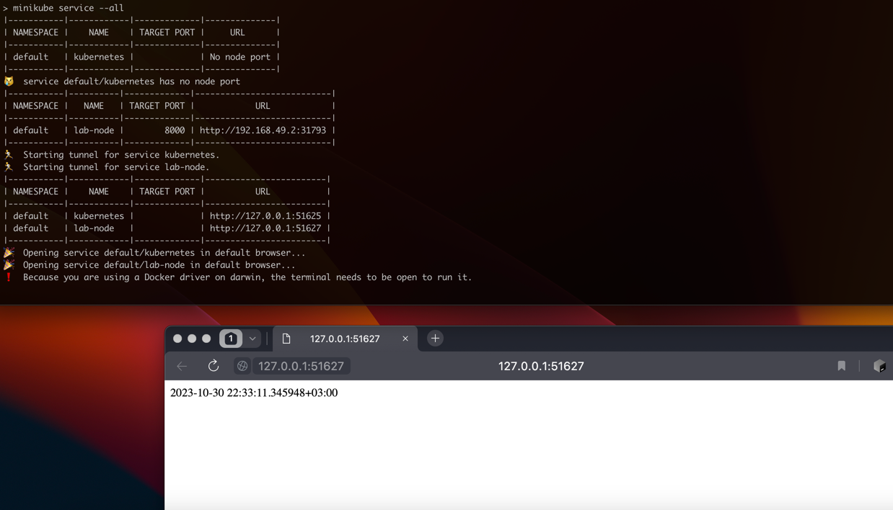
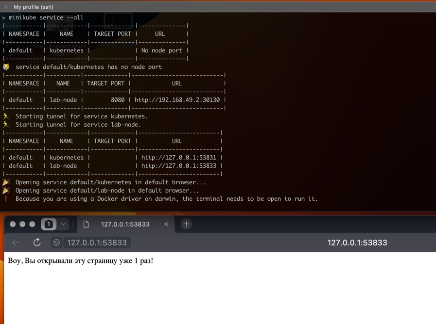

## Running the application on Kubernetes
To run my python application I used the following commands:
```
kubectl create deployment lab-node --image=klemencja/app_python
kubectl expose deployment lab-node --type=LoadBalancer --port=8000
minikube service lab-node
```

After the minkube response:
```
|-----------|----------|-------------|---------------------------|
| NAMESPACE |   NAME   | TARGET PORT |            URL            |
|-----------|----------|-------------|---------------------------|
| default   | lab-node |        8000 | http://192.168.49.2:32617 |
|-----------|----------|-------------|---------------------------|
🏃  Starting tunnel for service lab-node.
|-----------|----------|-------------|------------------------|
| NAMESPACE |   NAME   | TARGET PORT |          URL           |
|-----------|----------|-------------|------------------------|
| default   | lab-node |             | http://127.0.0.1:49801 |
|-----------|----------|-------------|------------------------|
```
The page with running python application was opened:


### Checking pods and services state
```
kubectl get pods,svc
NAME                            READY   STATUS    RESTARTS   AGE
pod/lab-node-576c4646c7-wqshl   1/1     Running   0          3m32s

NAME                 TYPE           CLUSTER-IP      EXTERNAL-IP   PORT(S)          AGE
service/kubernetes   ClusterIP      10.96.0.1       <none>        443/TCP          30h
service/lab-node     LoadBalancer   10.109.131.29   <pending>     8000:32617/TCP   3m6s
```

### Cleanup
After successfull test I cleaned my service and deployment with commands:
```
kubectl delete service lab-node
kubectl delete deployment lab-node
```


## Apply from configuration files
I added configuration files for deployment and service and started them by command:
`kubectl apply -f python_app`
The output is:
```
deployment.apps/lab-node created
service/kubernetes configured
service/lab-node created
```

Getting pods and services `kubectl get pods,svc`:
```
NAME                           READY   STATUS    RESTARTS   AGE
pod/lab-node-f6f6c9c48-jklsv   1/1     Running   0          8m11s
pod/lab-node-f6f6c9c48-k7x88   1/1     Running   0          8m11s
pod/lab-node-f6f6c9c48-mrp58   1/1     Running   0          8m11s

NAME                 TYPE           CLUSTER-IP      EXTERNAL-IP   PORT(S)          AGE
service/kubernetes   ClusterIP      10.96.0.1       <none>        443/TCP          31h
service/lab-node     LoadBalancer   10.105.180.38   <pending>     8000:31793/TCP   8m11s
```

Running the services `minikube service --all`:



## Apply k8s configuration files for Kotlin application


`kubectl apply -f kotlin_app/`
```
deployment.apps/lab-node created
service/kubernetes unchanged
service/lab-node created
```

Getting pods and services `kubectl get pods,svc`:
```
kubectl get pods,svc
NAME                            READY   STATUS    RESTARTS   AGE
pod/lab-node-6d795f4486-8d7r8   1/1     Running   0          42s
pod/lab-node-6d795f4486-fgjkr   1/1     Running   0          42s
pod/lab-node-6d795f4486-jr9ls   1/1     Running   0          42s

NAME                 TYPE           CLUSTER-IP       EXTERNAL-IP   PORT(S)          AGE
service/kubernetes   ClusterIP      10.96.0.1        <none>        443/TCP          2d5h
service/lab-node     LoadBalancer   10.108.150.168   <pending>     8080:30130/TCP   42s
```

